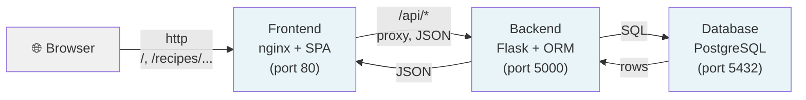

# rezeptbuch Documentation

## Project identity & goals
`rezeptbuch` is a local-network recipe hub. It is intended to let users create, edit, remove, and browse recipes from a browser on the local network.

The core recipe shape is:
- title
- description
- ingredients as a list of `[amount, unit, name]`
- ordered work instructions

## Scope
This repository covers the web application and its supporting runtime stack.

In scope:
- React frontend for recipe management and browsing
- Flask backend for validation, persistence, and API access
- PostgreSQL database running in Docker
- shared configuration through a root-level `.env` plus a checked-in `.env.example`

Out of scope:
- public internet exposure
- complex recommendation feature

## Architecture overview
The target deployment uses three containers:
- frontend container for the React app
- backend container for the Flask API
- database container for PostgreSQL

The frontend talks to the backend over HTTP. The backend owns validation, persistence rules, and API shape. The database stores recipe data and related records.



In production nginx serves the built React app and proxies `/api` to the
backend, so the browser uses a single origin. In development the Vite dev
server (port 5173) proxies `/api` to the backend instead.

Main request flows (all JSON over HTTP):
- **list recipes** — `GET /api/recipes` → backend queries all recipes (newest
  first) → serialized array.
- **create recipe** — `POST /api/recipes` → schema validation → service inserts
  recipe + ordered ingredients/instructions → `201` with the new recipe.
- **update recipe** — `PUT /api/recipes/{id}` → validation → service replaces
  fields and child collections → `200` with the updated recipe.
- **delete recipe** — `DELETE /api/recipes/{id}` → service deletes recipe
  (children cascade) → `204`.

The full contract is specified in [`api-doc.yaml`](api-doc.yaml).

## Service boundaries
Frontend responsibilities:
- render forms, lists, and detail views
- validate obvious user input before submit
- call backend APIs
- keep presentation state local to the UI

Backend responsibilities:
- define API routes and request schemas
- validate recipe payloads
- translate API operations into database actions
- return consistent error responses

Database responsibilities:
- persist recipes, ingredients, and work instructions
- support schema migrations and safe data updates

## Implementation decisions (ADRs)
Durable decisions are recorded in `.github/decisions/`:
- [0001](../.github/decisions/0001-record-architecture-decision.md) — ADR template
- [0002](../.github/decisions/0002-data-model-and-api-shape.md) — data model and REST API shape
- [0003](../.github/decisions/0003-stack-and-container-topology.md) — technology stack and container topology

## Development setup

### Prerequisites
- Node.js 18+ (for frontend)
- Python 3.10+ (for backend)
- Docker & Docker Compose (for containerized database or full stack)
- PostgreSQL client tools optional (for manual database inspection)

### Configuration
1. Copy `.env.example` to `.env`
2. Update `.env` with local values:
   - Database credentials (user, password, name)
   - Service URLs (backend, database host)
   - Flask config (debug mode, secret key)

### Option 1: Manual Setup (Local Development)

#### 1. Database
Start PostgreSQL in Docker:
```bash
docker run --rm -d \
  --name rezeptbuch-db \
  -e POSTGRES_USER=<DB_USER> \
  -e POSTGRES_PASSWORD=<DB_PASSWORD> \
  -e POSTGRES_DB=<DB_NAME> \
  -p 5432:5432 \
  postgres:16-alpine
```

Or use Docker Compose with just the database service:
```bash
docker compose up -d postgres
```

#### 2. Backend
In the `backend/` directory:
```bash
# Install dependencies
python -m venv venv
source venv/bin/activate
pip install -r requirements.txt

# Run database migrations
flask db upgrade

# Start Flask development server (port 5000)
flask run
```

Verify:
```bash
curl http://localhost:5000/api/recipes
```

#### 3. Frontend
In the `frontend/` directory:
```bash
# Install dependencies
npm install

# Start Vite dev server (port 5173)
npm run dev
```

Access in browser: `http://localhost:5173`

The Vite dev server proxies `/api` requests to `http://localhost:5000`.

#### Shutdown
Stop each service independently:
```bash
# Backend: Ctrl+C in the terminal
# Frontend: Ctrl+C in the terminal
# Database:
docker stop rezeptbuch-db
```

### Option 2: Docker Compose (Full Stack)

Start all three services together:
```bash
docker compose up
```

Access frontend in browser: `http://localhost`

The containers communicate over the internal Docker network:
- Frontend container runs nginx (port 80)
- Backend container runs Flask (port 5000)
- Database container runs PostgreSQL (port 5432)

#### Rebuild after code changes
```bash
# Rebuild without cache (for dependency changes)
docker compose up --build

# Rebuild specific service
docker compose up --build frontend
docker compose up --build backend
```

#### Access logs
```bash
# All services
docker compose logs -f

# Single service
docker compose logs -f backend
docker compose logs -f frontend
```

#### Database inspection
```bash
# Connect to running database container
docker compose exec postgres psql -U <DB_USER> -d <DB_NAME>
```

#### Cleanup
```bash
# Stop and remove containers
docker compose down

# Remove containers AND volumes (deletes all data)
docker compose down -v
```

**Note on volumes:** Volumes created by Docker Compose are deleted when running `compose down` because they are created dynamically by Compose and not declared as external. This is expected behavior for development. To persist data across `compose down`, define volumes as external in the `compose.yaml` file.

## Testing strategy
Use layered testing:
- unit tests for validation and utility functions
- integration tests for API endpoints and persistence behavior
- UI tests for important frontend flows once the interface is available

## CI / CD overview
The repository should eventually gate merges on:
- formatting
- linting
- type checks where applicable
- backend tests
- frontend tests
- container build validation

## Security & secrets
- Never commit `.env` with real values.
- Keep `.env.example` free of secrets and sufficient for onboarding.
- Review every new environment variable before adding it to the repository.

## Contributing
Use short, reviewable changes and link related ADRs when a change affects system design. Prefer focused pull requests that touch one concern at a time.

## ADRs & decision log
Record decisions in `.github/decisions/` using one file per decision. The first decision can use the template file `0001-record-architecture-decision.md`.

## Change log
Track only user-visible or architecture-changing updates here. Keep entries concise and dated.

- 2026-06-15 — Initial implementation: Flask CRUD API (recipes, ingredients,
  ordered instructions) with Marshmallow validation and Alembic migrations;
  React + Vite frontend with list/detail/create/edit/delete flows; PostgreSQL;
  Docker Compose for the full stack; backend and frontend test suites.